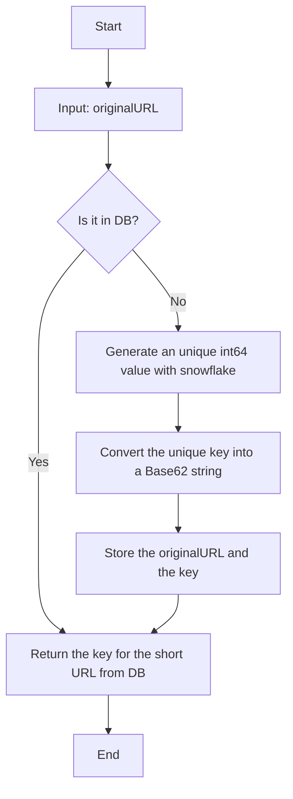
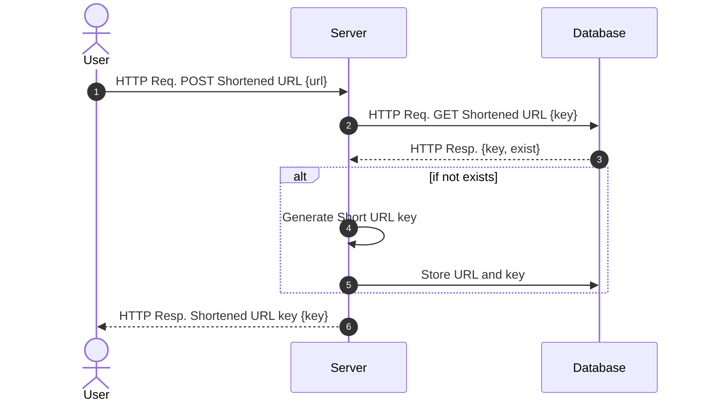
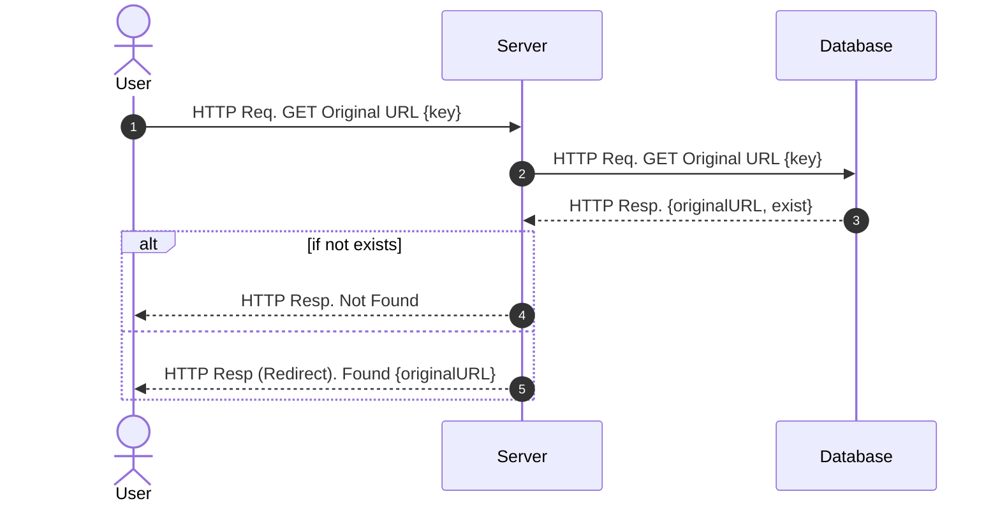

# URL Shortener Service

## Requirements
- It shortens the given URLs.
- It redirects to the original URL by getting a shortened URL.
- It provides metrics for monitoring.
- Scalability, Availability, Reliability

## APIs
```bash
POST /shorten  # it returns a key value for shortened url
GET  /:key     # it redirects to the original url
GET  /docs     # swagger UI
GET  /metrics  # prometheus metrics
```

You can simply test it with `curl`.
```bash
$ curl -X 'POST' 'http://localhost:8080/shorten' \
    -H 'accept: application/json' \
    -H 'Content-Type: application/json' \
    -d '{ "url": "https://www.google.com/search?q=longlonglonglonglonglonglonglonglonglonglongurl" }'

{"key":"M8uIUx0W000"}
```

Go to http://localhost:8080/M8uIUx0W000 on your browser.


## System Design
### Overview

- Server: [Echo](https://echo.labstack.com/) (Golang)
- Database: [Redis](https://redis.io/)

### URL Shortening


## Sequence Diagram
### URL Shortening


### URL Redirection


## How to Run
### Option 1: Localhost
Install [redis](https://redis.io/docs/getting-started/installation/), [golang](https://go.dev/doc/install), and run:
```bash
$ redis-server
$ make run  # in another terminal
```

### Option 2: Docker
Install [docker](https://docs.docker.com/engine/install/) and run:
```bash
$ docker-compose up
```

### Option 3: Kubernetes
TBD

## Tasks
- [x] APIs: url shortening, redirection, swagger UI, metrics
- [x] Code Formatting w/ `make format`
- [x] Code Linting w/ `make lint`
- [x] `Dockerfile` and `docker-compose.yaml`
- [ ] e2e test w/ [echo testing](https://echo.labstack.com/guide/testing/)
- [ ] Load Balancer (k8s)
- [ ] Auto Scaling (k8s)
- [ ] Ingress (k8s)
- [ ] SSL (k8s)
- [ ] Monitoring (k8s)
- [ ] Load Tests w/ [Locust](https://locust.io/)

## Commands
```bash
make run            # build and run the project
make run-profile    # build and run the project with profiler
make setup-dev      # install go packages

# below commands are available after `make setup-dev`
make docs           # generate swagger ui
make format         # format the codes
make lint           # lint the codes
```
