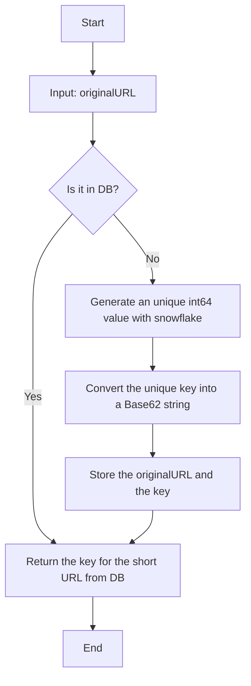
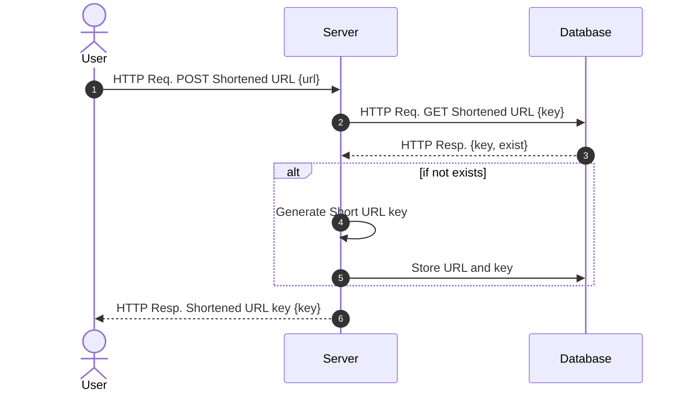
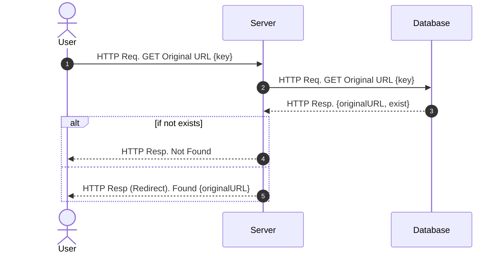

# URL Shortener Service

## Contents
- [Requirements](https://github.com/Curt-Park/url-shortener#requirements)
- [Tasks](https://github.com/Curt-Park/url-shortener#tasks)
- [APIs](https://github.com/Curt-Park/url-shortener#apis)
- [System Design](https://github.com/Curt-Park/url-shortener#system-design)
  - Overview
  - URL Shortening
- [Sequence Diagram](https://github.com/Curt-Park/url-shortener#sequence-diagram)
  - URL Shortening
  - URL Redirection
- [How to Run](https://github.com/Curt-Park/url-shortener#how-to-run)
  - Host OS
  - Docker
  - Kubernetes
- [Test](https://github.com/Curt-Park/url-shortener#test)
  - Unit Test
  - Load Test
- [How to Finalize](https://github.com/Curt-Park/url-shortener#finalize)
- [Commands](https://github.com/Curt-Park/url-shortener#commands)

## Requirements
- It shortens the given URLs.
- It redirects to the original URL by getting a shortened URL.
- It provides metrics for monitoring.
- Scalability, Availability, Reliability.

## Tasks
- [x] APIs: url shortening, redirection, swagger UI, metrics
- [x] Code Formatting w/ `make format`
- [x] Code Linting w/ `make lint`
- [x] `Dockerfile` and `docker-compose.yaml`
- [x] Unit Test w/ [echo testing](https://echo.labstack.com/guide/testing/)
- [x] Load Balancer (k8s)
- [x] Auto Scaling (k8s)
- [x] Monitoring: Server Metrics w/ Prometheus & Grafana (k8s)
- [x] Monitoring: Server Logs w/ Promtail & Loki & Grafana (k8s)
- [x] Load Tests w/ [Locust](https://locust.io/)
- [x] Redis failure on M1 mac (k8s - minikube)
- [x] Ingress w/ Traefik (k8s)
- [ ] TLS (k8s)
- [ ] Frontend

## APIs
```bash
POST /shorten  # it returns a key value for shortened url
GET  /:key     # it redirects to the original url
GET  /docs     # swagger UI
GET  /metrics  # prometheus metrics
```

You can simply test it with `curl`.
```bash
$ curl -X 'POST' 'http://localhost:8080/shorten' \
    -H 'accept: application/json' \
    -H 'Content-Type: application/json' \
    -d '{ "url": "https://www.google.com/search?q=longlonglonglonglonglonglonglonglonglonglongurl" }'

{"key":"M8uIUx0W000"}
```

Go to http://localhost:8080/M8uIUx0W000 on your browser.


## System Design
### Overview

- Server: [Echo](https://echo.labstack.com/) (Golang)
- Database: [Redis](https://redis.io/)

### URL Shortening


## Sequence Diagram
### URL Shortening


### URL Redirection


## How to Run
### Option 1: Host OS
This repository is tested on:
- redis-server: v7.0.5
- M1 MacMini (2020)

Install [redis](https://redis.io/docs/getting-started/installation/), [golang](https://go.dev/doc/install), and run:
```bash
$ redis-server
$ make run  # in another terminal
```

### Option 2: Docker
This repository is tested on:
- docker engine: v20.10.12
- docker-compose: v1.29.2
- M1 MacMini (2020)

Install [docker](https://docs.docker.com/engine/install/) and run:
```bash
$ docker-compose up
```

### Option 3: Kubernetes
This repository is tested on:
- minikube v1.29.0
- kubectl 1.26.1
- M1 MacMini (2020)

Install [minikube](https://minikube.sigs.k8s.io/docs/start/) and run:
```bash
make cluster  # init the k8s cluster
make charts   # install charts
# Check all pods are running
# kubectl get pods
```

#### Access to URL-Shortener
Add host information in `/etc/hosts`:
```bash
127.0.0.1 url-shortener.local
```

To access grafana and url-shortner w/ localhost,
```bash
minikube tunnel
```

Now, you can access `url-shortener` service through http://url-shortener.local/ .

To open swagger UI, open http://url-shortener.local/docs/index.html

#### Access to Grafana
Open Grafana on the web-browser:
http://url-shortener.local:3000/

- id: admin
- pw: prom-operator

Let's configure loki as data sources to monitor the service logs.
- `Configuration` -> `Data sources` -> `Add data sources`


- Select `Loki`


- Add URL: http://loki.default.svc.cluster.local:3100
- Click `Save & test` on the bottom.


- `Explore` -> Select `Loki`


- `job` -> `default/url-shortner` -> `Show logs`


- Ta-da!


- You can see the server metrics as well: `Explore` -> `Prometheus` -> `job` -> `url-shortener` -> `Use query`.


- Ta-da!


## Test
### Unit Tests
```bash
make utest
```

### Load tests
You will need to install [Python3](https://www.python.org/downloads/) for this.
```bash
pip install locust  # just at the first beginning
make ltest
```

You need to
Open http://localhost:8089/


Scenario: Every v-user sends a request of shortening URL or redirection once a second.

- tests with `docker-compose.yaml`
- Mac Mini 2020

NOTE: By default, minikube starts with 2 CPUs and 2GB of memory, so it shows lower performance than docker-compose settings.

## Finalize
You can clear the cluster by running:
```bash
make finalize
```

## Commands
```bash
make run            # build and run the project
make run-profile    # build and run the project with profiler
make setup-dev      # install go packages

# below commands are available after `make setup-dev`
make docs           # generate swagger ui
make format         # format the codes
make lint           # lint the codes

# tests
make utest          # run unit tests
make cover          # check the unit test coverage
make ltest          # load test w/ locust

# k8s
make cluster        # create a minikube (k8s) cluster
make charts         # install all services
make remove-charts  # remove all services
make finalize       # finalize the cluster
```
